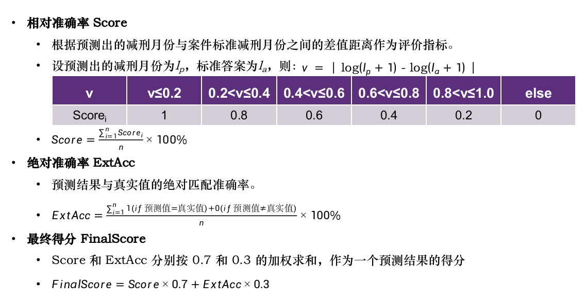

# BDA_PredictionOfCommutationTimeForOffenders

海量公开的司法数据，使得AI辅助解决法律领域问题成为一个有价值的研究课题。通过AI方法对减刑结果进行预测，也就是利用深度学习等相关技术，建立减刑预测模型，预测罪犯将获得的减刑时长，可以作为对司法过程的非人工监督，以促进执法公正的建设。

本项目是《大数据分析》项目配套的Team合作子项目，来自计算机专业的四位技术人员选择CCF BDCI数据竞赛：罪犯减刑时长预测作为选题，依次通过赛题分析、数据分析与预处理、算法设计、结果分析和优化思考五个步骤，对该选题进行了深入研究，研究结果达到TOP10左右，为该选题提供了有效的解决方案。

## 1.项目构成

| 名称                   | 用途                                                         |
| ---------------------- | ------------------------------------------------------------ |
| process_data文件夹     | 数据集，本项目待处理的源数据                                 |
| 停用词表.txt           | 文档，用于文本预处理：剔除常见词，提高模型对文本司法特征的提取准确度 |
| process_data.py        | 代码，用于文本预处理                                         |
| Textcnn.py             | 代码，采用模型Text CNN                                       |
| bert.py                | 代码，采用模型BERT                                           |
| bert_infer.py          | 代码，采用模型RoBerta / LawFormer                            |
| bert_preprocess.py     | 代码，在BERT模型基础上结合文本预处理                         |
| machine_learning文件夹 | 代码，采用5个传统机器学习模型：Random Forest/XGBoost/SVM/KNN/MLP |
| resources              | 代码，参考开源代码和公开论文中提到的方法实现的数据预处理/分词/特征提取/多分类/回归 |

## 2.评价指标

## 3.实际效果

| 排名 | 最终得分FinalScore | 相对准确率Score | 绝对准确率ExtAcc | 提交次数 |
| ---- | ------------------ | --------------- | ---------------- | -------- |
| 1    | 0.8433             | 0.9487          | 0.5975           | 32       |
| 2    | 0.8344             | 0.9420          | 0.5834           | 35       |
| 3    | 0.8343             | 0.9495          | 0.5655           | 23       |
| 4    | 0.8168             | 0.9349          | 0.5412           | 5        |
| 5    | 0.8163             | 0.9341          | 0.5413           | 42       |
| 6    | 0.8161             | 0.9381          | 0.5314           | 57       |
| 7    | 0.8139             | 0.9317          | 0.5392           | 23       |
| 8    | 0.8131             | 0.9378          | 0.5221           | 8        |
| 9    | 0.8109             | 0.9331          | 0.5258           | 29       |
| 10   | 0.8040             | 0.9289          | 0.5124           | 13       |
| Our  | 0.7909             | 0.9098          | 5134             | 3        |

## 4.相关贡献

| 序     | 名   | 算法/模型分工             | 项目分工                           |
| ------ | ---- | ------------------------- | ---------------------------------- |
| leader | DJH  | BERT、多分类器、Resources | 研究框架、赛题分析、优化思考、汇总 |
| 2      | WDZ  | BERT、TextCNN             | 数据分析与预处理                   |
| 3      | WGY  | BERT、RoBERTa             | 算法设计                           |
| 4      | WMH  | BERT、LawFormer           | 结果分析                           |
